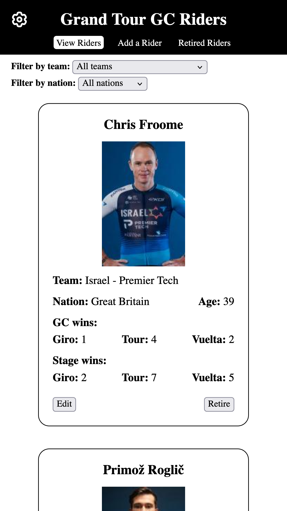
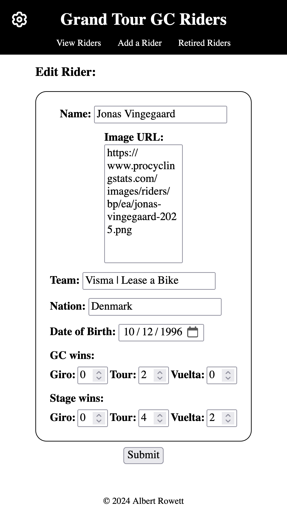
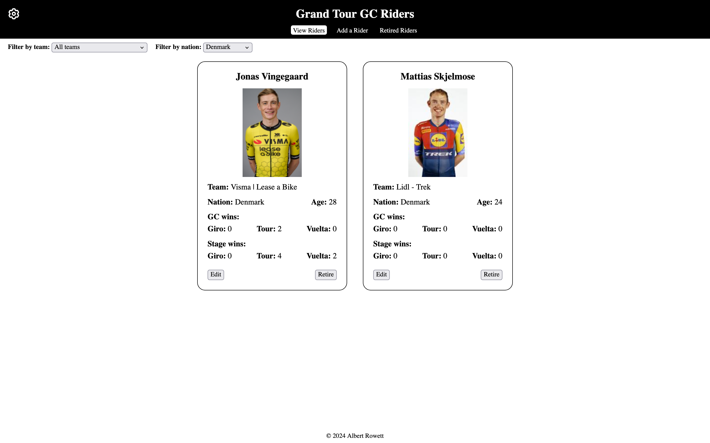
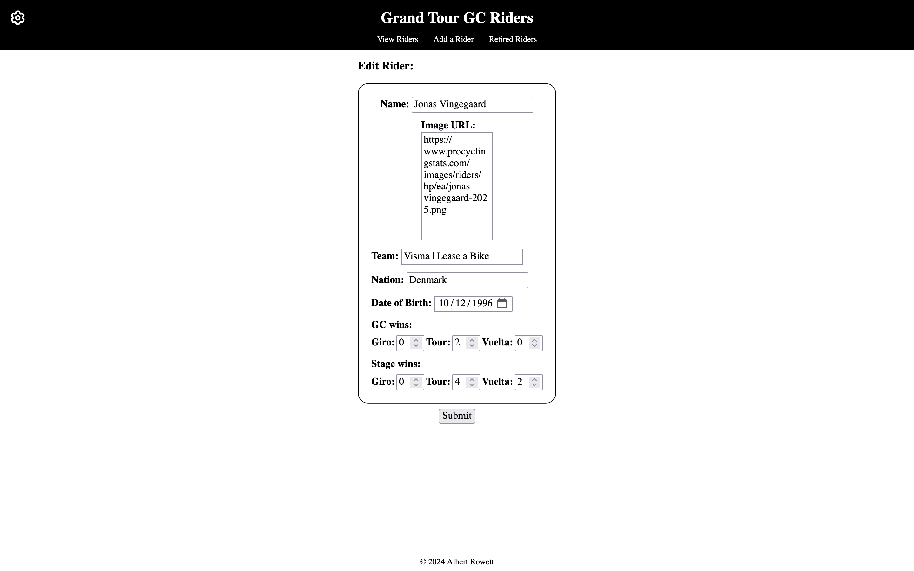

# Grand Tour GC Riders - Collection App

Full-stack PHP web app for collecting and showcasing the top Grand Tour general classification (GC) riders.

[Live site](https://grand-tour-gc-riders.2023-bertr.dev.io-academy.uk)

## Introduction

Built as part of a bootcamp at iO Academy, the aim of this project was to understand back-end data retrieval, practise writing SQL queries, and gain familiarity with PHP as a new programming language. As a big cycling fan, I chose to ‘collect’ professional cyclists, building a collection that concisely summarises and compares the top GC riders’ performances at the three Grand Tours (Giro d'Italia, Tour de France and Vuelta a España).

The app was built without a framework to focus on understanding the fundamentals of back-end development, including database management, data retrieval and manipulation, and handling user input. I utilised MariaDB (a MySQL-compatible database) for database management and Docker to ensure a consistent development environment. Unit tests were written using PHPUnit, marking my first experience with unit testing. The front end was generated through PHP-based HTML rendering and styled with CSS and JavaScript.

This project gave me a better understanding of database interactions and a greater appreciation for frameworks like Laravel, which handle many of the tasks that I had to perform manually here. Since I hadn’t yet been introduced to the MVC design pattern, I was able to independently identify the need for separation of concerns it addresses and develop a similar approach by separating the logic and presentation of each page. Although I could have finished the project sooner, returning to it after about a year gave me the valuable experience of familiarising myself with an unfamiliar codebase. In addition to implementing a couple of additional features, I significantly improved the codebase by addressing error handling, reducing repetition and enhancing readability, making the app more robust and maintainable. It was really encouraging to see how much my development skills had improved in the space of a year, and I’m proud of how the project turned out.

## Features

- **CRUD operations.** Add, view and edit riders in the collection.
- **Filtering.** Filter riders by team and/or nationality to quickly identify related riders.
- **Soft deletion.** Mark riders as retired, moving them to a separate page without permanently deleting their records.
- **Front- and back-end validation.** Guarantees data integrity by preventing invalid data submission with front-end checks and redirecting to error pages for invalid back-end data.
- **Error handling for database issues.** Redirects users to error pages if unexpected database issues occur, avoiding crashes and maintaining usability.
- **Responsive design.** Optimisation for both mobile and desktop ensures a seamless user experience across devices.
- **Auto page redirects.** Redirects users to appropriate pages if invalid query string values are provided, preventing navigation errors.
- **Testing.** Unit testing of the back-end validation ensures critical reliability.

## Screenshots

### Mobile

 &nbsp;&nbsp;&nbsp;
 &nbsp;&nbsp;&nbsp;
 &nbsp;&nbsp;&nbsp;
 &nbsp;&nbsp;&nbsp;
 &nbsp;&nbsp;&nbsp;

### Desktop

 &nbsp;&nbsp;&nbsp;
 &nbsp;&nbsp;&nbsp;
 &nbsp;&nbsp;&nbsp;
 &nbsp;&nbsp;&nbsp;
 &nbsp;&nbsp;&nbsp;

## Installation

1. Clone the repository:

    `git clone https://github.com/albertRowett/grand-tour-gc-riders.git`

2. Navigate to the project directory:

    `cd grand-tour-gc-riders`

3. Ensure the following are installed on your system:

    - **PHP**: 8.2 or higher
    - **Composer**: 2.8 or higher
    - **MariaDB**: 11.3 or higher

    If using Docker, ensure your containers are configured to use these versions.

4. Install dependencies:

    `composer install`

5. Set up the database:

    Create a new MariaDB database on your system and import one of the provided SQL files:

    - Import [empty_db.sql](./db_backups/empty_db.sql) to start with just the database structure
    - Import a file from [db_backups/populated](./db_backups/populated) for a pre-populated database

6. Configure the database connection:

    Open [database.php](./database.php) and update the database connection details.

7. Serve the application:

    `php -S localhost:8000`

8. Access the app:

    Open a browser and navigate to [http://localhost:8000](http://localhost:8000).

## Testing

This project includes unit tests covering the back-end validation.

Run all tests with: `./vendor/bin/phpunit tests`

## Contributing

While no major updates are planned for this project, I welcome bug reports and suggestions for improvements. Drop me an email at <albertRowett@gmail.com>

## Acknowledgements

Advice and assistance during the initial build:

-   My trainer [@ashleycoles](https://github.com/ashleycoles) at [iO Academy](https://io-academy.uk)

Favicon image source:

-   [freesvg.org](https://freesvg.org)

 

_All last accessed 26 November 2024_
